# 👋 Hi, I'm **Azamjon Saydahbarov**

  

  
  
  
  

  
  
  
  

  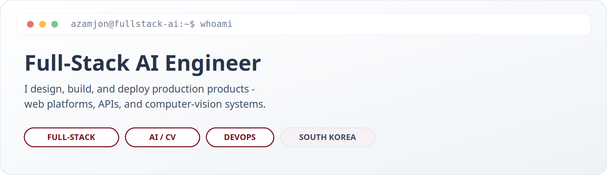

---

## 🧑‍💼 About Me

I'm a **Full-Stack AI Engineer** based in **South Korea**.  
I own the full loop: **UI → API → database → AI inference → Docker / Nginx deploy**.

I ship real products — marketplaces, e-commerce, and computer-vision systems — not just demos.

| | |
|:--|:--|
| 🎓 | Production-style systems: booking, auth, admin, payments flow, ML APIs |
| 🌍 | South Korea · open to Full-Stack / AI Engineer roles |
| 💬 | **Uzbek · English · Korean (learning)** |
| ✉️ | [saydahbarovazamjon@gmail.com](mailto:saydahbarovazamjon@gmail.com) |
| 📱 | +82 10-8349-4111 |
| 💼 | [LinkedIn](https://www.linkedin.com/in/azamjon-saydahbarov-a55647406/) |
| ✈️ | [Telegram @iamsaidakbarov](https://t.me/iamsaidakbarov) |

---

## 🚀 What I Can Work With

> Stacks from **real shipped projects** (Fixora, GadjetStore, Carvia, FoodAI, Lumora) — not a wishlist.

  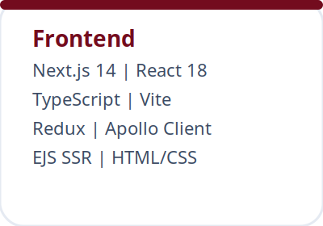
  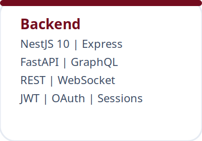
  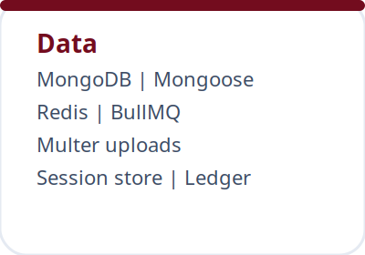
  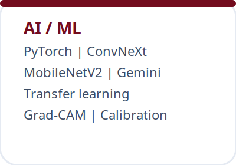
  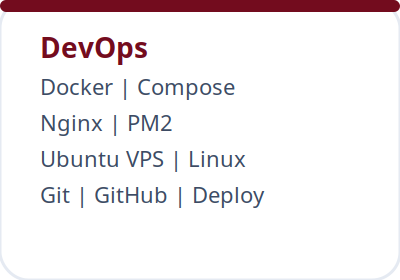

  

| Layer | Technologies |
|------|----------------|
| **Frontend** | Next.js 14 · React 18 · TypeScript · Vite · Redux Toolkit · Apollo Client · EJS SSR |
| **Backend** | NestJS 10 · Express.js · FastAPI · GraphQL · REST · WebSocket |
| **Auth** | JWT · OAuth (Google / Kakao / Apple) · Express Session · RBAC |
| **Database** | MongoDB · Mongoose · Redis · BullMQ |
| **AI / ML** | PyTorch · ConvNeXt-Tiny · MobileNetV2 · Google Gemini · Transfer learning · Confidence gating |
| **DevOps** | Docker · Docker Compose · Nginx · PM2 · Ubuntu VPS · Git / GitHub |

  
  
  
  
  
  
  
  

---

## 💼 Featured Projects

| Project | What I built | Stack | Live |
|--------|--------------|-------|------|
| **[Fixora](https://github.com/SaydahbarovAzamjon-cloud/Fixora)** | Apple repair marketplace — booking, chat, deposit, admin | NestJS · GraphQL · MongoDB · Next.js · Gemini · Docker | [fixoranext.com](https://fixoranext.com) |
| **[GadjetStore](https://github.com/SaydahbarovAzamjon-cloud/Gadjet-Store)** | E-commerce + SSR admin, stock reserve, orders | React · Vite · Express · MongoDB · JWT · PM2 | [gadjetstore.uz](https://gadjetstore.uz) |
| **[Carvia](https://github.com/SaydahbarovAzamjon-cloud/carvia)** | Vehicle make/model from one image (37 classes) | ConvNeXt · FastAPI · Next.js · Docker | CV product |
| **[FoodAI](https://github.com/SaydahbarovAzamjon-cloud/food-type-ai)** | Organic vs processed food classifier | MobileNetV2 · PyTorch · FastAPI | [foodai.azamdev.uz](https://foodai.azamdev.uz) |
| **[Lumora](https://github.com/SaydahbarovAzamjon-cloud/lumora-backend)** | AI personal stylist (backend + frontend) | NestJS · GraphQL · Redis · BullMQ · Next.js | In progress |

---

## 🧩 How I Work

  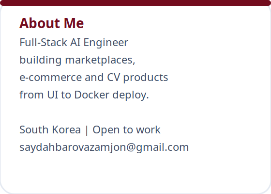
  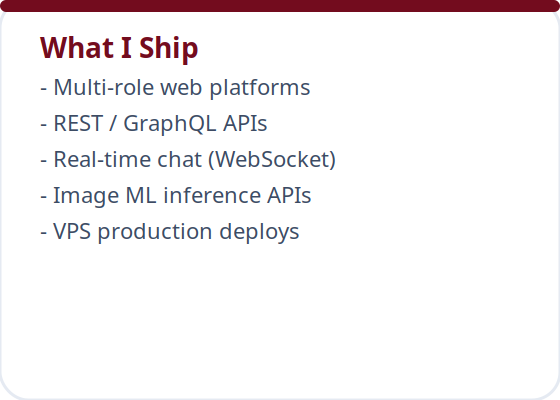
  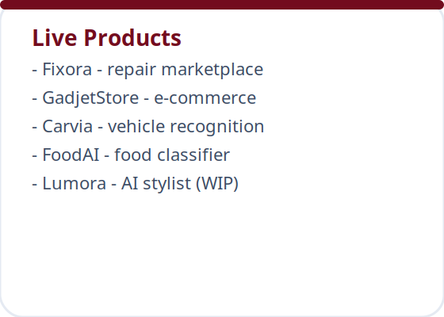
  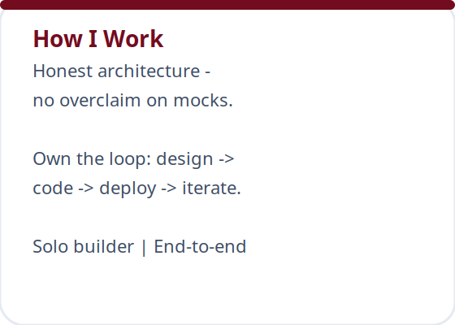

| Focus | Principle |
|------|-----------|
| **End-to-end** | Frontend + backend + AI + deploy — one owner when needed |
| **Honest MVP** | Mocks / small test sets stay visible; architecture stays production-ready |
| **Clear trade-offs** | GraphQL vs REST, JWT vs session, model size vs accuracy — I explain *why* |

---

## 📊 GitHub Activity

  
  

  

  

---

## 🐍 Contribution Snake

  

Snake ko‘rinmasa — shu Action’ni bir marta Run qiling

Repo’da fayl: <code>.github/workflows/snake.yml</code>  
Keyin: <b>Actions → Generate Snake → Run workflow</b>

---

## 🎧 Developer Widgets

<table>
  <tr>
    <td width="28%" align="center">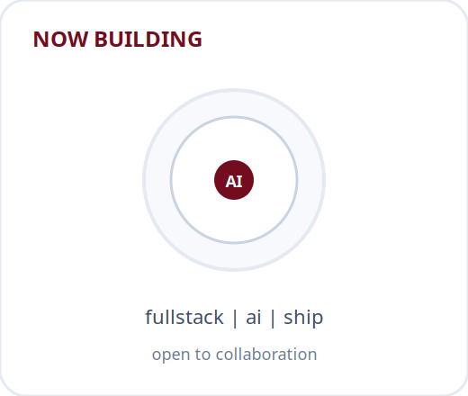</td>
    <td width="44%" align="center">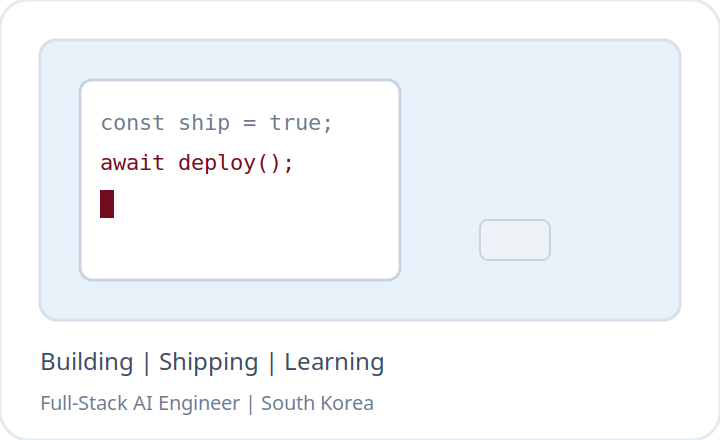</td>
    <td width="28%" align="center">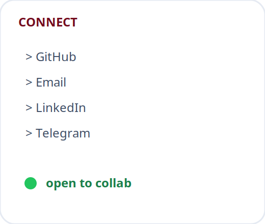</td>
  </tr>
</table>

  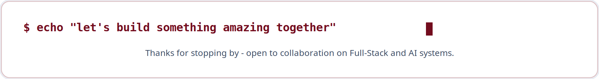

---

## 🤝 Looking For

Open to:

- **Full-Stack Engineer** — Next.js / NestJS / Express / MongoDB  
- **AI / Computer Vision Engineer** — PyTorch inference APIs, FastAPI  
- **Backend Engineer** with product ownership mindset  

---

## 🔗 Connect

  
  
  
  

  
  
  

  
  

  

⭐ Thanks for visiting — building in public, 2026

